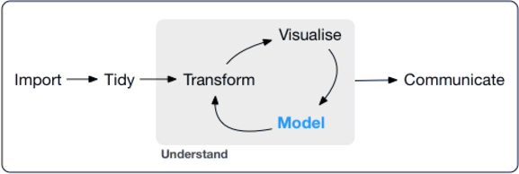
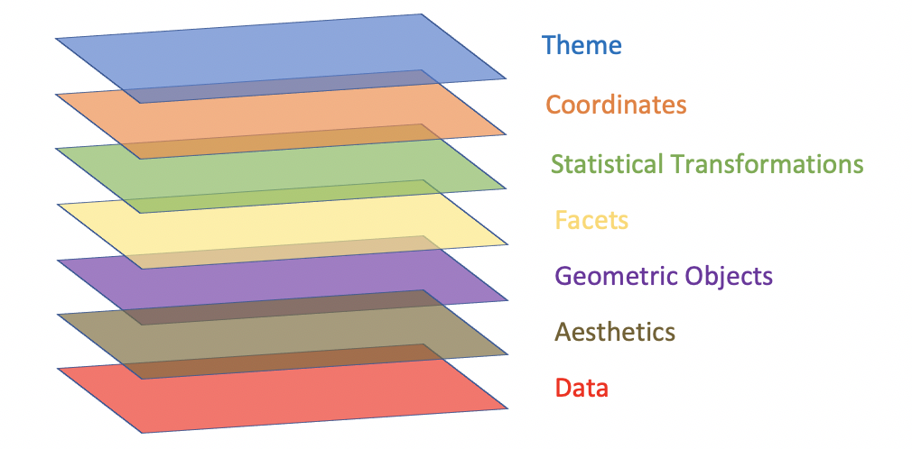

```{css, echo=FALSE}
.header-section-number::after {
  content: ".";
}

body{ /* Normal  */
      font-size: 16px;
  }

```

```{r setup, include = FALSE}

require(tidyverse)
require(kableExtra)
require(DT)

knitr::opts_chunk$set(fig.width = 8, fig.height = 4,
                      echo = TRUE, warning = FALSE,
                      message = FALSE, fig.align = "center")

theme_set(theme_minimal(14))

formato_real_graf <- function(values, nsmall = 0) {
  values %>%
    as.numeric() %>%
    format(nsmall = nsmall, decimal.mark = ",", big.mark = ".") %>%
    str_trim()
}


```


# Introdução ao TurnOver

- O Tunover nada mais é do que a taxa de rotatividade dos funcionários de uma empresa. Mede o percentual de desligamento em um determinado período de tempo, geralmente em fechamentos anuais. Este tipo de análise não mede só e unicamente o número bruto de desligamentos, mas também têm o intuito de explorar a fundo quais os fatores que influenciam neste processo.

- Através de variáveis operacionais e indicadores da empresa, utilizam-se diversas ferramentas que vão desde análises estatísticas até técnicas de Machine Learning. Tudo isso engrandece o estudo e traz mais credibilidade para se falar deste assunto.

- Além de tudo isso, deve-se deixar claro alguns pontos relevantes para quem trabalha ou deseja trabalhar nesta vertente. Primeiro que o contato com outras áreas é fundamental para deixar a análise robusta e alinhada com o negócio que demanda a resolução: provável falar com gerentes, diretores, área de RH ou os Business Partner dos setores da empresa. Segundo que requer muita responsabilidade e princípio de confidencialidade, pois lida com informações completamente sensíveis, como salário, risco de desligamento por gestor, dentre outras.

- Por fim, o Turnover já traz resultados expressivos atualmente. Diversas empresas enriqueceram as informações sobre seus colaboradores a fim de analisá-las e executarem ações para fazer acontecer uma coisa que, mesmo que óbvia, não era muito praticada: **funcionário feliz traz bons resultados!**


# Entendimento do problema


Neste exemplo de causa, nós extraímos uma base de dados do portal Kaggle (completar as informações)!!!, em que trata-se de uma análise de turnover demissional, o que se volta mais na movimentação de desligamentos dos colaboradores. Com isso, temos as seguintes variáveis:


- **stag**: experiência (em anos ou meses)
- **event**: demitido ou não
- **gender**: gênero
- **age**: idade
- **industry**: tipo de indústria
- **profession**: setor em que trabalha
- **traffic**: meio em que o candidato se candidatou
- **coach**: presença de um **buddy**
- **head_gender**: gênero do seu **buddy**
- **greywage**: algo relacionado com taxas para o governo
- **way**: meio de transporte para o trabalho
- **extraversion**, **independ**, **selfcontrol**, **anxiety**, **novator**: Escala de teste Big5 


# R e Rstudio

<p align="center">
  
<br>
<em> <span>Disponível <a href="https://bcrf.biochem.wisc.edu/all-tutorials/tutorial-materials-r-rstudio/">aqui</a></span> </em>
</p>


## O que é o R?

- Linguagem e ambiente para estatística computacional

- Baseada na linguagem S

- **1993**: Disponibilização a versão beta do projeto

- **2000**: Versão 1.0.0 foi disponibilizada pelo CRAN

## Evolução dos pacotes


- **1997**: CRAN servidor em que os pacotes, documentações e versões do R foi criiado

- Exemplo de primeiros pacotes disponibilizados: **date** e **bootstrap**

- Atualmente temos pacotes mais robustos para análise de dados, machine learning, em relação aos anteriores 


## Tidyverse

- **2017:** Criado pelo Hadley Wickham. Biblioteca que une várias outras bibliotecas para análise de dados, machine learning, etc, para melhorar o organização e eficiência no pipeline de ciência de dados

- O fluxo/pipeline segue o seguinte esquema:


<p align="center">

<br>
<em> <span>Disponível em <a href="https://bcrf.biochem.wisc.edu/all-tutorials/tutorial-materials-r-rstudio/">R for Data Science</a></span> </em>
</p>


- Os principais pacotes do `tidyverse` são:

  1. ggplot2
  2. dplyr
  3. tidyr
  4. readr
  5. purrr
  6. tibble
  7. stringr
  8. forcats


## ggplot2


- Criado em 2007

-	Baseado no livro The Grammar of Graphics, que menciona os componentes da visualização de dados

- Tanto é que o gg de ggplot2 vem de gramática dos gráficos

- A filosofia do ggplot2 segue a seguinte linha de pensamento em relação a camadas:


<p align="center">

<br>
<em> <span>Disponível em <a href="https://bcrf.biochem.wisc.edu/all-tutorials/tutorial-materials-r-rstudio/">R for Data Science</a></span> </em>
</p>


## Bibliotecas alternativas em Python

- Ggplot: única diferença é que no python não tem a quebra de linha no final, então temos que colocar o "+ \\"

- Plotnine

- Altair: baseado no VEGA, que também segue essa filosofia de Gramática dos Gráficos


## Pacotes utilizados


```{r pacotes_utilizados}

require(tidyverse)
require(kableExtra)
require(DT)

```

## Importação dos dados e estrutura

```{r dados}


dados <- read.csv(file = "data/turnover-data-set.csv")


dados <-  
  dados %>% 
  mutate(event = as.character(x = event),
         event = case_when(event == 0 ~ "Não",
                           TRUE ~ "Sim"))


dados %>% 
  DT::datatable(rownames = FALSE, filter = 'top', 
                options = list(pageLength = 5, dom = 'tip',
                               autoWidth = TRUE))


```

# Análise Exploratória de Dados


- A Análise Exploratória de Dados é uma técnica estatística que consiste em um conjunto de ferramentas com a finalidade de organizar, resumir e descrever características importantes de um conjunto de dados, por meio de: (**i**) gráficos, que é uma forma de representação dinâmica dos dados da tabela, sendo mais eficiente para visualização das informações; (**ii**) tabelas, que são um método não discursivo de mostrar informações, utilizando dados numéricos e símbolos, ordenados de acordo com as variáveis analisadas no fenômeno em estudo; e (**iii**) medidas de sínteses, para uma melhor visualização e interpretação das informações e com isso se pode obter resultados sobre a variável em estudo (BUSSAB; MORETTIN, 2013).

- Para o mundo de People Analytics, é uma etapa de extrema necessidade, pois ela nos traz as primeiras impressões para análises posteriores. Por meio dos gráficos e tabelas, podemos entender e tirar boas conclusões sobre o material estudado


## Proporção da variável `Event`

```{r}

cores <- c("#70B7B3", "firebrick")

dados %>% 
  count(event) %>% 
  mutate(perc = n/sum(n)*100) %>% 
  ggplot(data = ., aes(x = event, y = perc, fill = event)) +
  geom_bar(stat = "identity", colour = "black") +
  geom_text(aes(label = formato_real_graf(round(perc, 2))), vjust = -0.9, size = 5) +
  theme(legend.position = "null") +
  labs(x = "Desligamento", y = "Percentual") +
  scale_y_continuous(limits = c(0, 60)) +
  scale_fill_manual(values = cores)


```


- Podemos notar que a base de dados está bem equilibrada quanto ao número de trabalhadores "ativos" e desligados. Isso indica um alto número de desligamentos. 

- Para melhorar nossa análise, tentaremos fazer alguns questionamentos a fim de direcionar nossa abordagem e tentar encontrar os principais fatores para o desligamentos destes individuos. São elas:


  1. Existe diferença entre os gêneros quanto ao desligamento?
  2. Qual indústria ou setor de trabalho mais desliga?
  3. Quanto a idade dos profissionais, existe influência no desligamento?
  4. E o meio de candidatura? Impacta nos deligamentos também?


## Análise socioeconômica


- Primeiro vamos tentar descobrir o perfil socioeconômico dos trabalhadores por meio das variáveis: Gênero, Idade, Tempo de Experiência, Ramo da Indústria que Trabalha, Setor que Trabalha, Meio de Transporte Utilizado e Meio de Candidatura para a Vaga de Emprego.


### Variáveis numéricas: `idade` e `tempo de experiência`


```{r}


dados %>% 
  select(event, age, stag) %>% 
  group_by(event) %>% 
  pivot_longer(age:stag, names_to = "variavel", values_to = "valor") %>% 
  ggplot(data = ., aes(x = variavel, y = valor, fill = variavel)) +
  geom_boxplot(colour = "black") +
  theme(legend.position = "null") +
  labs(x = "Variável", y = "Valor")  +
  facet_wrap(~ event) +
  scale_fill_manual(values = cores)

```


```{r}

testet_age <- t.test(dados$age ~ dados$event)
testet_stag <- t.test(dados$stag ~ dados$event)

paste("P-valor age:", round(testet_age$p.value, 4))
paste("P-valor stag:", round(testet_stag$p.value, 4))

```


### Variáveis categóricas

- Gênero, Ramo da Indústria que Trabalha, Setor que Trabalha, Meio de Transporte Utilizado e Meio de Candidatura para a Vaga de Emprego.


```{r, fig.height = 10, fig.width = 10}


df_chr <- 
  dados %>% 
  mutate(profession = ifelse(profession == "BusinessDevelopment",
                             "BusinessDev.", profession)) %>% 
  select(event, gender, industry, profession, traffic, way)


rafs_geom_bar2 <- function(df, x, y){
  
  df %>% 
    group_by(.data[[y]]) %>% 
    count(.data[[x]], sort = TRUE) %>% 
    ggplot(data = ., aes(x = reorder(.data[[x]], n), y = n, 
                         fill = .data[[x]])) +
    geom_bar(stat = "identity", colour = "black") +
    facet_wrap(~ .data[[y]]) +
    labs(y = "Quantidade", x = "", title = paste("Variável:", x)) +
    theme_minimal(14) +
    theme(legend.position = "null") +
    scale_fill_brewer(palette = "Set3") +
    coord_flip()
    
}

ys1 <-
  df_chr %>% 
  select(-c(event, industry, profession)) %>% 
  names

all_plots2 <- map2(.x = ys1, .y = "event", 
                   .f = ~ rafs_geom_bar2(df = df_chr, 
                                         x = .x,
                                         y = .y))

cowplot::plot_grid(plotlist = all_plots2, nrow = 3)


ys3 <-
  df_chr %>% 
  select(c(industry, profession)) %>% 
  names

all_plots3 <- map2(.x = ys3, .y = "event", 
                   .f = ~ rafs_geom_bar2(df = df_chr, 
                                         x = .x,
                                         y = .y))

cowplot::plot_grid(plotlist = all_plots3, nrow = 2)

```

- O gênero `feminino` possui maior frequência, em relação ao gênero oposto, para quem é desligado ou não

- As plataformas **youjs**, **empjs** e **rabrecNErab** são as que mais indicam candidatos no geral 

- O ônibus é o meio de transporte mais utilizado e a caminhada é o menos utilizado


## Características da personalidade que mais 


```{r}

which_nth_highest_richie <- function(x, n){
  
  for(i in seq_len(n - 1L)) x[x == max(x)] <- -Inf
  which(x == max(x))
  
}

df_tops <- 
  dados %>% 
  select(extraversion:novator) %>% 
  rownames_to_column("row") %>% 
  mutate(top1 = apply(.[2:6], 1, function(x) names(x)[which_nth_highest_richie(x = x, n = 1)]),
         top2 = apply(.[2:6], 1, function(x) names(x)[which_nth_highest_richie(x = x, n = 2)])) %>% 
  unnest(cols = c(top1, top2)) %>% 
  distinct(row, .keep_all = TRUE)


#---- TOP1 POR INDIVÍDUO

dados <- 
  dados %>% 
  bind_cols(df_tops %>% select(top1, top2))
  
  
dados %>% 
  filter(event == "Não") %>% 
  count(event, top1, sort = TRUE) %>% 
  ggplot(data = , aes(x = reorder(top1, n), y = n)) +
  geom_bar(stat = "identity", colour = "black", fill = "#70B7B3") +
  geom_text(aes(label = n), vjust = 1.6, color = "white", size = 3.5) +
  labs(x = "Característica da personalidade", y = "Quantidade") 

```


```{r}


#--- TOP1 POR INDUSTRIA


df_industria_tops <- 
  dados %>% 
  filter(event == "Não") %>% 
  group_by(industry) %>% 
  summarise(extraversion = mean(extraversion, na.rm = TRUE),
            independ = mean(independ, na.rm = TRUE),
            selfcontrol = mean(selfcontrol, na.rm = TRUE),
            anxiety = mean(anxiety, na.rm = TRUE),
            novator = mean(novator, na.rm = TRUE)) %>% 
  ungroup %>% 
  rownames_to_column("row") %>%
  mutate(top1_ind = apply(.[3:6], 1, 
                      function(x) names(x)[which_nth_highest_richie(x = x, n = 1)]),
         top2_ind = apply(.[3:6], 1, 
                      function(x)          names(x)[which_nth_highest_richie(x = x, n = 2)]),
         top3_ind = apply(.[3:6], 1, 
                      function(x)          names(x)[which_nth_highest_richie(x = x, n = 3)])) %>% 
  unnest(cols = c(top1_ind, top2_ind, top3_ind)) %>% 
  distinct(row, .keep_all = TRUE)


df_score <- 
  dados %>% 
  inner_join(df_industria_tops %>% select(industry, top1_ind, top2_ind, top3_ind), by = "industry")
  


df_score %>%
  mutate(col1 = ifelse(top1 == top1_ind, 1, 0),
         col2 = ifelse(top1 == top2_ind, 1, 0),
         col3 = ifelse(top1 == top3_ind, 1, 0),
         col4 = ifelse(top2 == top1_ind, 1, 0),
         col5 = ifelse(top2 == top2_ind, 1, 0),
         col6 = ifelse(top2 == top3_ind, 1, 0),
         score = col1 + col2 + col3 + col4 + col5 + col6) %>% 
  group_by(traffic) %>% 
  summarise(score = sum(score)) %>% 
  arrange(-score) %>% 
  ggplot(data = , aes(x = reorder(traffic, score), y = score)) +
  geom_bar(stat = "identity", colour = "black", fill = "#70B7B3") +
  geom_text(aes(label = score), vjust = 1.6, color = "white", size = 3.5) +
  labs(title = "Score de quem mais acerta por plataforma",
       x = "Plataforma", y = "Score")


```


```{r}

df_industria_tops %>% 
  filter(industry %in% c("Banks", "manufacture", "IT", "Consult", "State")) %>% 
  select(industry, top1_ind: top3_ind) %>% 
  DT::datatable(rownames = FALSE, filter = 'top', 
                options = list(pageLength = 5, dom = 'tip',
                               autoWidth = TRUE))


```
